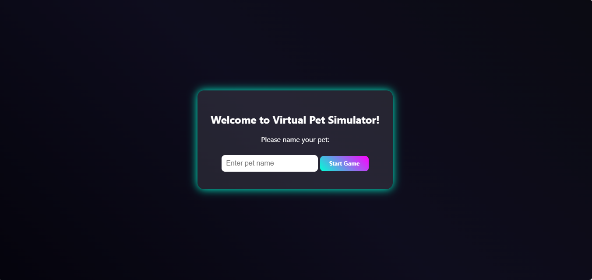
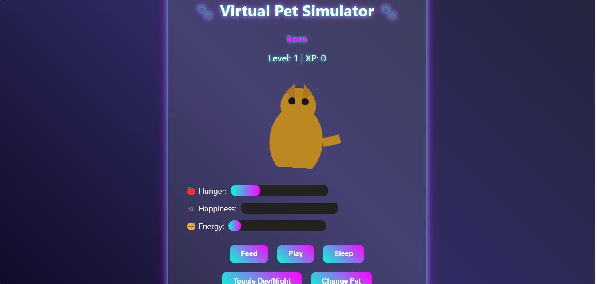
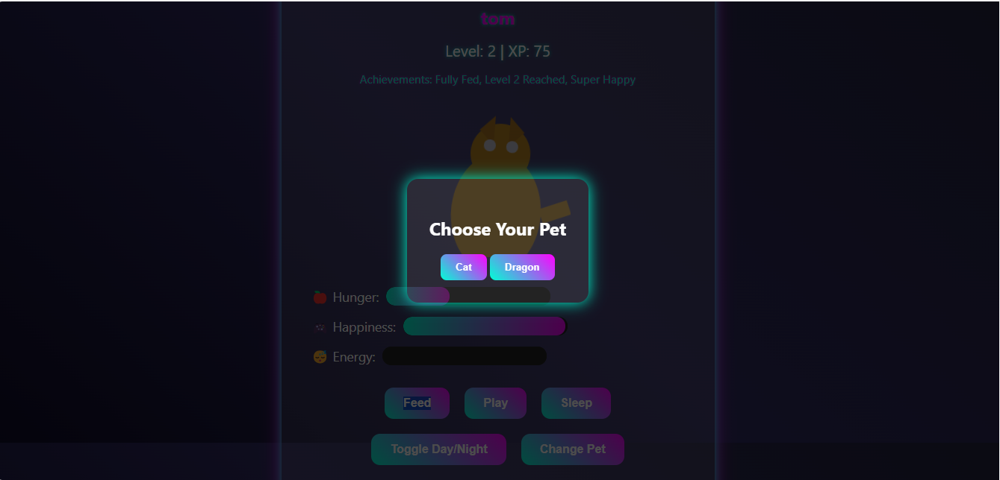
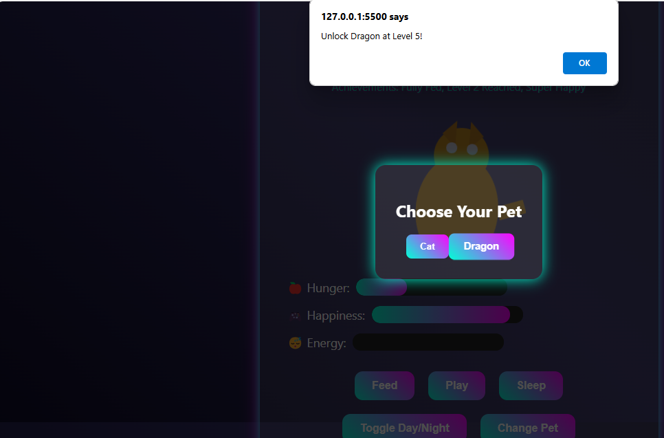

Virtual Pet Simulator
Welcome to Virtual Pet Simulator, a browser-based virtual pet game inspired by My Talking Tom! This project allows you to care for and interact with two unique pets—a cat and a dragon—drawn and animated using the Canvas API, with sounds generated via the Web Audio API. No external assets are required, making it a lightweight and self-contained experience.
Features

Pets: Choose between a cat and a dragon, each with unique stat dynamics.
Cat: Lower hunger decay, higher happiness gain.
Dragon: Higher hunger decay, unlocked at level 5.

Interactions: Feed, play, and put your pet to sleep to manage hunger, happiness, and energy.
Progression: Earn XP through interactions, level up, and unlock achievements.
Animations: Programmatic animations for happy (bounce), sad (shake), sleepy (sway), and night modes.
Customization: Name your pet at the start, saved locally.
Day/Night Cycle: Toggle between day and night with visual effects.

Prerequisites

A modern web browser (e.g., Google Chrome, Mozilla Firefox).
No external dependencies or assets required.

Open index.html in your web browser to start the game.

Usage

Start the Game: Enter a pet name when prompted and click "Start Game."
Interact with Your Pet:
Feed: Increases hunger and happiness.
Play: Boosts happiness, reduces energy and hunger.
Sleep: Restores energy, slightly reduces happiness.
Toggle Day/Night: Switches the background and pet appearance.
Change Pet: Switch between cat and dragon (dragon unlocks at level 5).

Monitor Stats: Watch hunger, happiness, and energy via progress bars.
Track Progress: Check your level, XP, and achievements.

Project Structure
virtual-pet-simulator/
├── index.html        # Main HTML file with canvas and UI
├── style.css         # CSS for neon aesthetic and animations
├── script.js         # JavaScript with Canvas and Web Audio logic
└── README.md         # This file

Customization

Pet Appearance: Modify drawCat or drawDragon in script.js to change colors or shapes.
Sound Effects: Adjust frequencies in playSound in script.js for different tones.
Game Balance: Tweak hungerRate, happinessRate, energyRate in pets object in script.js.

Contributing

Fork the repository.
Create a branch: git checkout -b feature-name.
Make changes and commit: git commit -m "Add feature-name".
Push to the branch: git push origin feature-name.
Submit a pull request.

License
This project is open-source. Feel free to use, modify, and distribute under the MIT License (see below).
MIT License

Copyright (c) 2025 [Your Name]

Permission is hereby granted, free of charge, to any person obtaining a copy
of this software and associated documentation files (the "Software"), to deal
in the Software without restriction, including without limitation the rights
to use, copy, modify, merge, publish, distribute, sublicense, and/or sell
copies of the Software, and to permit persons to whom the Software is
furnished to do so, subject to the following conditions:

The above copyright notice and this permission notice shall be included in all
copies or substantial portions of the Software.

THE SOFTWARE IS PROVIDED "AS IS", WITHOUT WARRANTY OF ANY KIND, EXPRESS OR
IMPLIED, INCLUDING BUT NOT LIMITED TO THE WARRANTIES OF MERCHANTABILITY,
FITNESS FOR A PARTICULAR PURPOSE AND NONINFRINGEMENT. IN NO EVENT SHALL THE
AUTHORS OR COPYRIGHT HOLDERS BE LIABLE FOR ANY CLAIM, DAMAGES OR OTHER
LIABILITY, WHETHER IN AN ACTION OF CONTRACT, TORT OR OTHERWISE, ARISING FROM,
OUT OF OR IN CONNECTION WITH THE SOFTWARE OR THE USE OR OTHER DEALINGS IN THE
SOFTWARE.

Acknowledgments

Inspired by My Talking Tom for interactive pet care mechanics.
Utilizes HTML5 Canvas API and Web Audio API for inbuilt graphics and sound.

Contact
For questions or suggestions, reach out at your.mulaniakil154@example.com.
Last updated: 03:14 AM IST, Tuesday, July 29, 2025

IMAGES :

